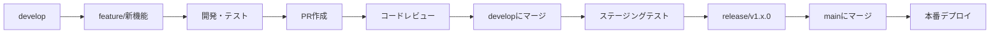
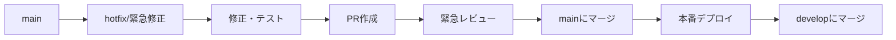

# 🌿 Gitブランチ戦略

## 📋 **概要**
ShiftWithプロジェクトのGitブランチ戦略とワークフローを定義します。本番環境の安全性を最優先に、効率的な開発フローを実現します。

## 🏗️ **ブランチ構成**

### 🌳 **メインブランチ**

#### `main` - 本番環境ブランチ
- **目的**: 本番環境のソースコード
- **保護**: 直接push禁止、PR経由必須
- **デプロイ**: 本番環境（Vercel）に自動デプロイ
- **マージ**: レビュー承認後のみ

#### `develop` - 開発統合ブランチ ⭐ **新規作成予定**
- **目的**: 機能開発の統合・テスト
- **保護**: 直接push禁止、PR経由必須
- **デプロイ**: ステージング環境に自動デプロイ
- **マージ**: 機能ブランチからのPR

### 🌿 **作業ブランチ**

#### `feature/機能名` - 機能開発ブランチ
- **作成元**: `develop`ブランチ
- **マージ先**: `develop`ブランチ
- **命名規則**: `feature/ユーザー認証機能`、`feature/教材作成機能`

#### `fix/修正内容` - バグ修正ブランチ
- **作成元**: `develop`ブランチ
- **マージ先**: `develop`ブランチ
- **命名規則**: `fix/ログインエラー修正`、`fix/パフォーマンス改善`

#### `hotfix/緊急修正内容` - 緊急修正ブランチ
- **作成元**: `main`ブランチ
- **マージ先**: `main`ブランチ + `develop`ブランチ
- **命名規則**: `hotfix/セキュリティ脆弱性修正`

#### `release/バージョン` - リリース準備ブランチ
- **作成元**: `develop`ブランチ
- **マージ先**: `main`ブランチ + `develop`ブランチ
- **命名規則**: `release/v1.2.0`

## 🔄 **開発フロー**

### 📝 **通常開発フロー**



#### 1. 機能開発開始
```bash
# developブランチから開始
git checkout develop
git pull origin develop

# 機能ブランチ作成
git checkout -b feature/ユーザー認証機能
```

#### 2. 開発・テスト
```bash
# 開発作業
# テスト実行
npm run test
npm run type-check
npm run lint

# コミット
git add .
git commit -m "feat: ユーザー認証機能実装"
git push origin feature/ユーザー認証機能
```

#### 3. Pull Request作成
- GitHubでPR作成（feature → develop）
- レビュー依頼
- CI/CDチェック通過確認

#### 4. マージ・統合
```bash
# developブランチにマージ
git checkout develop
git pull origin develop
git merge feature/ユーザー認証機能
git push origin develop
```

### 🚨 **緊急修正フロー**



#### 1. 緊急修正開始
```bash
# mainブランチから開始
git checkout main
git pull origin main

# 緊急修正ブランチ作成
git checkout -b hotfix/セキュリティ修正
```

#### 2. 修正・テスト
```bash
# 緊急修正
# 最小限のテスト
npm run test:critical

# コミット
git add .
git commit -m "hotfix: セキュリティ脆弱性修正"
git push origin hotfix/セキュリティ修正
```

#### 3. 緊急PR・マージ
```bash
# mainにマージ
git checkout main
git merge hotfix/セキュリティ修正
git push origin main

# developにもマージ
git checkout develop
git merge hotfix/セキュリティ修正
git push origin develop
```

## 🛡️ **ブランチ保護ルール**

### 🔒 **mainブランチ保護**
- **直接push**: ❌ 禁止
- **PR必須**: ✅ 必須
- **レビュー**: ✅ 最低1名の承認必須
- **CI/CD**: ✅ 全チェック通過必須
- **マージ**: ✅ レビュー承認後のみ

### 🔒 **developブランチ保護**
- **直接push**: ❌ 禁止
- **PR必須**: ✅ 必須
- **レビュー**: ✅ 最低1名の承認必須
- **CI/CD**: ✅ 全チェック通過必須
- **マージ**: ✅ レビュー承認後のみ

### 🔒 **作業ブランチ保護**
- **直接push**: ✅ 許可
- **PR必須**: ✅ マージ時必須
- **レビュー**: ✅ マージ時必須

## 📋 **コミットメッセージ規約**

### 🎯 **形式**
```
<type>(<scope>): <description>

[optional body]

[optional footer]
```

### 📝 **Type一覧**
- `feat`: 新機能
- `fix`: バグ修正
- `docs`: ドキュメント更新
- `style`: コードスタイル修正
- `refactor`: リファクタリング
- `test`: テスト追加・修正
- `chore`: その他の変更

### 📝 **例**
```bash
git commit -m "feat(auth): ユーザー認証機能実装"
git commit -m "fix(login): ログインエラー修正"
git commit -m "docs(readme): セットアップ手順追加"
git commit -m "refactor(api): API構造リファクタリング"
```

## 🚀 **リリース管理**

### 📦 **リリース準備**
```bash
# developからリリースブランチ作成
git checkout develop
git pull origin develop
git checkout -b release/v1.2.0

# バージョン番号更新
# package.json, CHANGELOG.md更新
git add .
git commit -m "chore(release): v1.2.0準備"
git push origin release/v1.2.0
```

### 🚀 **リリース実行**
```bash
# mainにマージ
git checkout main
git merge release/v1.2.0
git push origin main

# developにもマージ
git checkout develop
git merge release/v1.2.0
git push origin develop

# タグ作成
git tag -a v1.2.0 -m "Release v1.2.0"
git push origin v1.2.0
```

## 🔧 **現在の状況と移行計画**

### 📊 **現在のブランチ状況**
- `main`: 本番環境（保護済み）
- `feature/本番環境保護体制構築`: 現在の作業ブランチ
- `develop`: **未作成** - 新規作成が必要

### 🎯 **移行計画**

#### Phase 1: developブランチ作成
```bash
# developブランチ作成
git checkout main
git checkout -b develop
git push origin develop

# 保護設定
# GitHubでdevelopブランチ保護設定
```

#### Phase 2: 現在の作業をdevelopに移行
```bash
# 現在の作業をdevelopにマージ
git checkout develop
git merge feature/本番環境保護体制構築
git push origin develop
```

#### Phase 3: 今後の開発フロー適用
- 新機能開発: `develop` → `feature/機能名`
- バグ修正: `develop` → `fix/修正内容`
- リリース: `develop` → `release/v1.x.0` → `main`

## 📊 **品質ゲート**

### ✅ **マージ前必須チェック**
- [ ] TypeScript型チェック: `npm run type-check`
- [ ] ESLint実行: `npm run lint`
- [ ] ビルド確認: `npm run build`
- [ ] 単体テスト: `npm test`
- [ ] E2Eテスト: playwright-mcp使用

### 📈 **品質基準**
- TypeScript/ESLintエラー: **0件**
- テストカバレッジ: **80%以上**
- ビルドエラー: **0件**
- セキュリティ脆弱性: **High/Critical 0件**

## 🚨 **緊急時対応**

### 🔥 **本番障害時の対応**
```bash
# 緊急修正ブランチ作成
git checkout main
git checkout -b hotfix/緊急修正

# 修正・最小限テスト
git add .
git commit -m "hotfix: 緊急修正"
git push origin hotfix/緊急修正

# 緊急PR作成・マージ
# 即座に本番デプロイ
```

### 🔄 **ロールバック手順**
```bash
# 前回の安定版を確認
git log --oneline -10

# 緊急ロールバック
git revert <問題のコミットハッシュ>
git push origin main
```

## 📚 **参考資料**

- [Git Flow](https://nvie.com/posts/a-successful-git-branching-model/)
- [Conventional Commits](https://www.conventionalcommits.org/)
- [GitHub Flow](https://guides.github.com/introduction/flow/)
