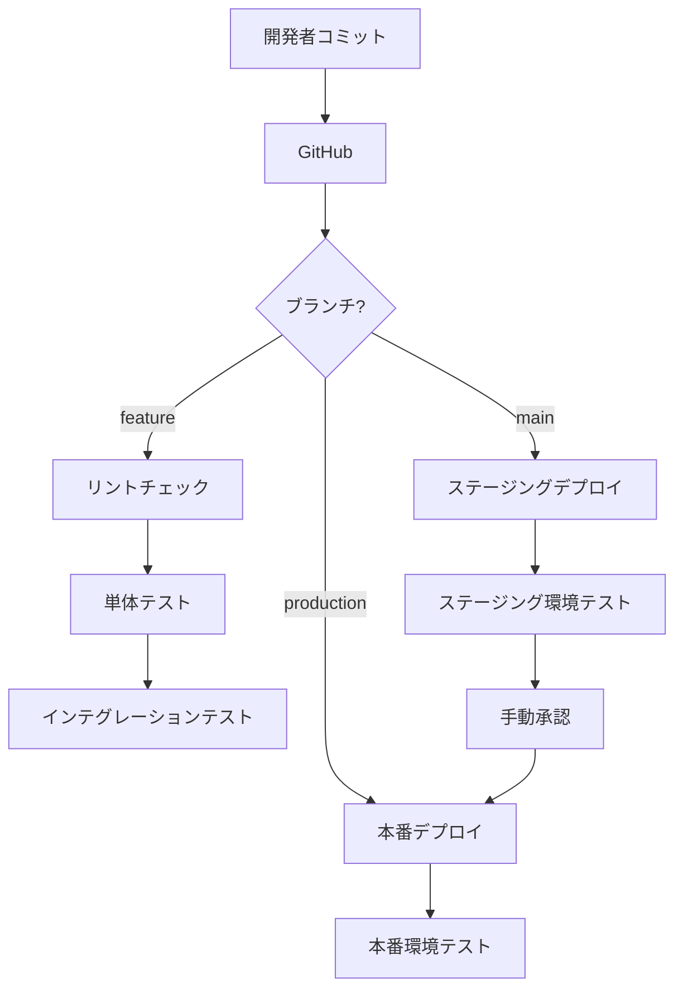

# デプロイメント構成図

## 関連ドキュメント
- [データベース詳細設計](../01_プロジェクト概要/05_データベース詳細設計.md)
- [APIインターフェース仕様書](./04_APIインターフェース仕様書.md)
- [コンポーネント詳細設計](../01_プロジェクト概要/06_コンポーネント詳細設計.md)
- [セキュリティ設計](./05_セキュリティ設計.md)
- [UI/UXデザイン仕様書](../01_プロジェクト概要/07_UI_UXデザイン仕様書.md)

## 概要
本ドキュメントはShiftWithアプリケーションのデプロイメント構成について記述します。インフラストラクチャ、CI/CDパイプライン、環境構成、モニタリングなどについて説明します。

## インフラストラクチャ構成

### 全体アーキテクチャ

```
                                    +---------------+
                                    |   Cloudflare  |
                                    |   (CDN/DNS)   |
                                    +-------+-------+
                                            |
                                            v
+---------------+              +---------------------------+
|   Supabase    | <----------> |      Hostinger VPS       |
|  (Backend)    |              |     (Next.js Frontend)   |
+-------+-------+              +---------------------------+
        |                                  |
        v                                  v
+---------------+              +---------------------------+
| Object Storage|              |     GitHub Actions        |
| (Media Files) |              |       (CI/CD)            |
+---------------+              +---------------------------+
```

### コンポーネント説明

#### フロントエンド
- **Hostinger VPS**
  - Ubuntu 22.04 LTS
  - Node.js 18 LTS
  - Next.js アプリケーション
  - Nginx Webサーバー

#### バックエンド
- **Supabase**
  - PostgreSQL データベース
  - Auth認証サービス
  - Functions (サーバーレス関数)
  - Realtime (リアルタイムサブスクリプション)
  - Storage (バイナリストレージ)

#### インフラサービス
- **Cloudflare**
  - DNS管理
  - CDNキャッシング
  - DDoS保護
  - WAF (Web Application Firewall)

#### CI/CD
- **GitHub Actions**
  - 自動ビルド
  - テスト実行
  - 静的解析
  - 自動デプロイ

## 環境構成

### 開発環境
- ローカル開発環境
  - ローカルSupabase (Docker)
  - Next.js開発サーバー
  - 環境変数: `.env.development.local`

### ステージング環境
- **目的**: QAテスト、受け入れテスト
- **構成**:
  - Hostinger VPS (staging)
  - Supabase Staging Project
  - 環境変数: `.env.staging`
- **アクセス制限**: 開発チームとテスターのみ

### 本番環境
- **目的**: エンドユーザー向けサービス提供
- **構成**:
  - Hostinger VPS (production)
  - Supabase Production Project
  - 環境変数: `.env.production`
- **アクセス制限**: 公開（認証機能によるアクセス制御）

## デプロイメントプロセス

### CI/CDパイプライン



### GitHub Actions ワークフロー

#### ビルド＆テストワークフロー
```yaml
name: Build and Test

on:
  push:
    branches: [ main, feature/* ]
  pull_request:
    branches: [ main ]

jobs:
  build-and-test:
    runs-on: ubuntu-latest
    steps:
      - uses: actions/checkout@v3
      - name: Setup Node.js
        uses: actions/setup-node@v3
        with:
          node-version: '18'
          cache: 'npm'
      - name: Install dependencies
        run: npm ci
      - name: Lint check
        run: npm run lint
      - name: Type check
        run: npm run type-check
      - name: Run unit tests
        run: npm run test:unit
      - name: Run integration tests
        run: npm run test:integration
      - name: Build
        run: npm run build
```

#### デプロイワークフロー
```yaml
name: Deploy

on:
  push:
    branches: [ main, production ]

jobs:
  deploy:
    runs-on: ubuntu-latest
    environment: ${{ github.ref == 'refs/heads/main' && 'staging' || 'production' }}
    steps:
      - uses: actions/checkout@v3
      - name: Setup Node.js
        uses: actions/setup-node@v3
        with:
          node-version: '18'
          cache: 'npm'
      - name: Install dependencies
        run: npm ci
      - name: Build
        run: npm run build
      - name: Deploy to Hostinger
        uses: appleboy/ssh-action@master
        with:
          host: ${{ secrets.SSH_HOST }}
          username: ${{ secrets.SSH_USERNAME }}
          key: ${{ secrets.SSH_KEY }}
          script: |
            cd /var/www/${{ github.ref == 'refs/heads/main' && 'staging' || 'production' }}.shiftwith.com
            git pull
            npm ci
            npm run build
            pm2 restart shiftwith-${{ github.ref == 'refs/heads/main' && 'staging' || 'production' }}
```

## サーバー設定

### Nginx設定

```nginx
server {
    listen 80;
    server_name shiftwith.com www.shiftwith.com;
    return 301 https://$host$request_uri;
}

server {
    listen 443 ssl http2;
    server_name shiftwith.com www.shiftwith.com;

    ssl_certificate /etc/letsencrypt/live/shiftwith.com/fullchain.pem;
    ssl_certificate_key /etc/letsencrypt/live/shiftwith.com/privkey.pem;
    ssl_protocols TLSv1.2 TLSv1.3;
    ssl_prefer_server_ciphers on;
    ssl_ciphers 'ECDHE-ECDSA-AES256-GCM-SHA384:ECDHE-RSA-AES256-GCM-SHA384:ECDHE-ECDSA-CHACHA20-POLY1305:ECDHE-RSA-CHACHA20-POLY1305:ECDHE-ECDSA-AES128-GCM-SHA256:ECDHE-RSA-AES128-GCM-SHA256';

    # セキュリティヘッダー
    add_header Strict-Transport-Security "max-age=31536000; includeSubDomains" always;
    add_header X-Content-Type-Options "nosniff" always;
    add_header X-Frame-Options "SAMEORIGIN" always;
    add_header X-XSS-Protection "1; mode=block" always;
    add_header Content-Security-Policy "default-src 'self'; script-src 'self' https://analytics.example.com; style-src 'self' https://fonts.googleapis.com; img-src 'self' https://storage.googleapis.com data:; font-src 'self' https://fonts.gstatic.com; connect-src 'self' https://api.example.com wss://realtime.example.com; frame-ancestors 'none'; form-action 'self';" always;

    # キャッシュ設定
    location ~* \.(css|js|jpg|jpeg|png|gif|ico|svg|woff|woff2|ttf|eot)$ {
        expires 30d;
        add_header Cache-Control "public, no-transform";
    }

    # Next.js API ルート
    location /api/ {
        proxy_pass http://localhost:3000;
        proxy_http_version 1.1;
        proxy_set_header Upgrade $http_upgrade;
        proxy_set_header Connection 'upgrade';
        proxy_set_header Host $host;
        proxy_cache_bypass $http_upgrade;
    }

    # Next.js アプリケーション
    location / {
        proxy_pass http://localhost:3000;
        proxy_http_version 1.1;
        proxy_set_header Upgrade $http_upgrade;
        proxy_set_header Connection 'upgrade';
        proxy_set_header Host $host;
        proxy_cache_bypass $http_upgrade;
    }
}
```

### PM2設定

```json
{
  "apps": [
    {
      "name": "shiftwith-production",
      "script": "node_modules/next/dist/bin/next",
      "args": "start",
      "instances": "max",
      "exec_mode": "cluster",
      "env": {
        "NODE_ENV": "production",
        "PORT": 3000
      }
    },
    {
      "name": "shiftwith-staging",
      "script": "node_modules/next/dist/bin/next",
      "args": "start",
      "instances": 1,
      "exec_mode": "fork",
      "env": {
        "NODE_ENV": "staging",
        "PORT": 3001
      }
    }
  ]
}
```

## データベースマイグレーション

### マイグレーション方針
1. Supabase Migrationを使用
2. 毎回のデプロイ前に実行
3. スキーマ変更はバージョン管理

### マイグレーションプロセス
```bash
# ローカルでのマイグレーション作成
supabase migration new create_materials_table

# マイグレーション適用
supabase db push

# 本番環境への適用（CI/CDパイプラインで自動実行）
supabase db push --db-url=$SUPABASE_DB_URL
```

## バックアップ戦略

### 自動バックアップ
- Supabaseの日次自動バックアップ
- 30日間の保持期間

### 手動バックアップ
- 重要な変更前の手動バックアップ
- リリース前の完全バックアップ

### リストア手順
1. Supabaseコンソールからバックアップを選択
2. Point-in-Time Recoveryの日時を指定
3. リストアプロセスを開始

## モニタリングとロギング

### アプリケーションモニタリング

- **Sentry**
  - エラートラッキング
  - パフォーマンスモニタリング
  - リアルタイムアラート

- **Google Analytics**
  - ユーザー行動分析
  - コンバージョン追跡
  - トラフィック分析

### インフラモニタリング

- **UptimeRobot**
  - サービス稼働状況監視
  - レスポンスタイム監視
  - ダウンタイムアラート

- **Datadog（将来実装）**
  - インフラメトリクス監視
  - ログ集約
  - APM (アプリケーションパフォーマンス監視)

### ロギング戦略

- **アプリケーションログ**
  - Winston/Pino を使用したログ生成
  - 構造化JSONログフォーマット
  - ログレベル: error, warn, info, debug

- **システムログ**
  - Nginx アクセス/エラーログ
  - Node.js プロセスログ
  - PM2 ログローテーション（7日間）

## スケーリング戦略

### 垂直スケーリング
- VPSリソース（CPU/メモリ）の増強
- データベースプランのアップグレード

### 水平スケーリング
- 将来的なマルチサーバー構成
- ロードバランサーの導入
- リードレプリカの設定

### CDNキャッシング
- 静的アセットのCloudflareキャッシング
- APIレスポンスのキャッシュ（適切な場合）
- ページレベルのキャッシュ戦略

## 障害復旧計画 (DRP)

### 想定シナリオと対応

#### 1. フロントエンドサーバーダウン
- 検知: UptimeRobot
- 対応: 
  1. PM2プロセスの自動再起動
  2. 必要に応じてVPSの再起動
  3. 障害が続く場合はバックアップサーバーへの切り替え

#### 2. データベース障害
- 検知: アプリケーションエラーログ
- 対応:
  1. Supabaseダッシュボードで状態確認
  2. 必要に応じてPoint-in-Time Recoveryを実行
  3. 障害報告とアラート送信

#### 3. ストレージ障害
- 検知: アプリケーションエラーログ
- 対応:
  1. Supabaseストレージバケットの状態確認
  2. 一時的な代替ストレージへの切り替え
  3. データ整合性の確認と修復

### 復旧時間目標 (RTO)
- 軽微な障害: 15分以内
- 中程度の障害: 1時間以内
- 重大な障害: 4時間以内

## セキュリティ対策

### ファイアウォール設定
- UFW (Uncomplicated Firewall)
  - SSH (ポート22): 特定IPのみ許可
  - HTTP/HTTPS (ポート80/443): 全許可
  - その他のポート: すべて拒否

### サーバーハードニング
- 定期的なOS/パッケージ更新
- 不要なサービスの無効化
- 強固なSSH認証設定（パスワード認証無効化）
- Fail2banによる不正アクセス検知

### SSL/TLS設定
- Let's Encryptによる自動証明書更新
- 強力な暗号スイートの設定
- HTTP/2の有効化
- HSTS (HTTP Strict Transport Security)の適用

## リリース管理

### リリースプロセス
1. feature ブランチでの開発
2. Pull Requestとコードレビュー
3. mainブランチへのマージ（ステージングデプロイ）
4. QAテストとUAT（ユーザー受け入れテスト）
5. productionブランチへのマージ（本番デプロイ）

### リリース頻度
- 小規模リリース: 週1回（水曜日）
- 中規模リリース: 月2回（隔週）
- 大規模リリース: 四半期ごと

### ホットフィックス対応
1. hotfixブランチの作成
2. 修正とテスト
3. main, productionの両方にマージ
4. 即時デプロイ

## ドキュメント

### システム構成ドキュメント
- インフラ構成図
- ネットワーク構成図
- サーバー設定詳細

### 運用マニュアル
- デプロイメント手順
- リリースチェックリスト
- 障害対応フロー
- バックアップ・リストア手順

### 開発者ドキュメント
- 環境構築手順
- デプロイメントプロセス
- テスト自動化手順
- コーディング規約 